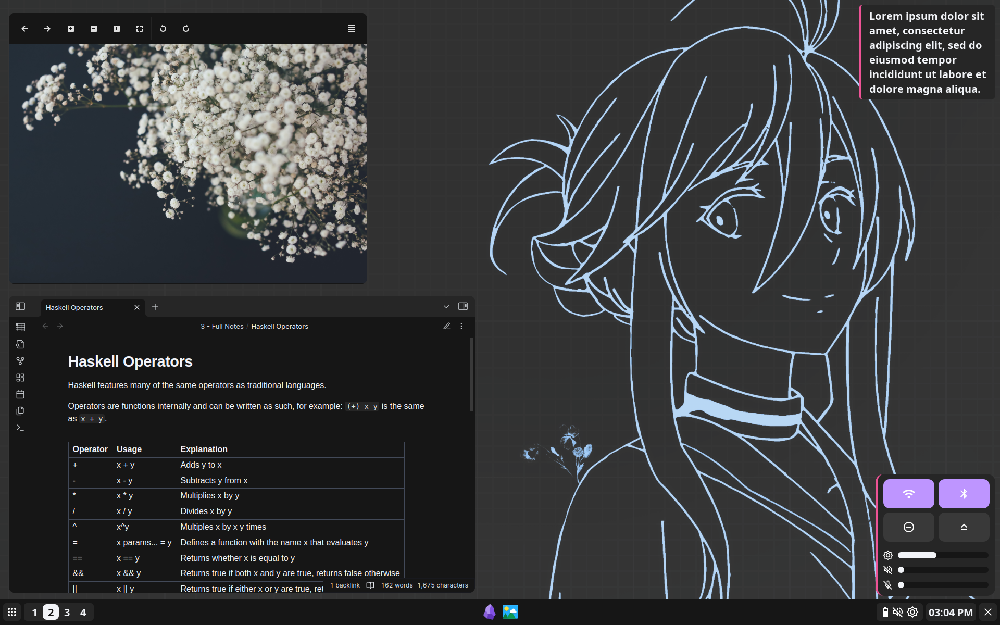

# Info
Distro: Debian
WM: BSPWM
Compositor: Picom
Launcher: Rofi (soon to be eww...)
Keybinds: SXHKD
Screenshots: Shotgun + Hacksaw
Wallpaper: Feh (looking for an alternative)
Widget System: Eww (might swap to Quickshell)
Shell: NUShell
Prompt: Starship
Terminal: Alacritty
Browser: Floorp
Code Editors: Lite-XL and Intellij IDEA Ultimate
Note Taker: Obsidian
File Manager: Nemo
Image Viewer: Viewnior

# Installation
I will not help you with installation, this is only to be used as reference for your own dotfiles.
